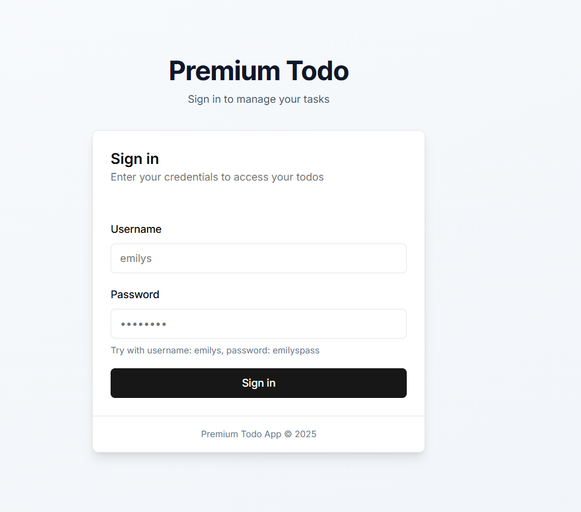
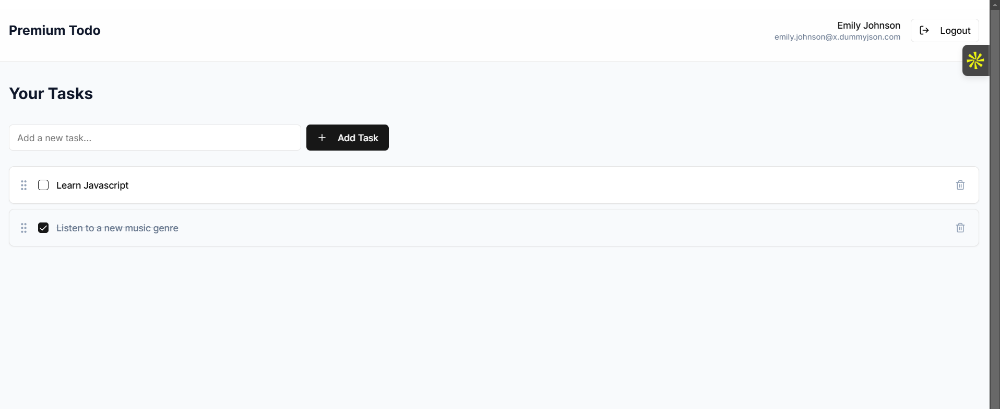
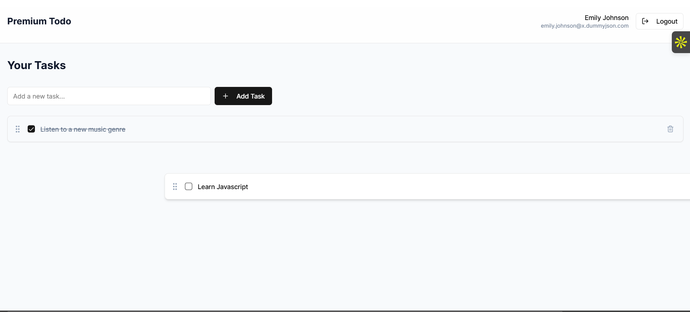
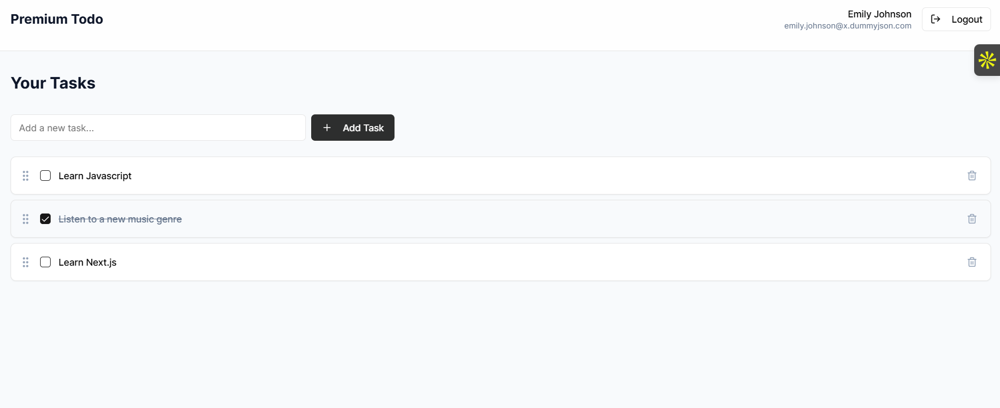
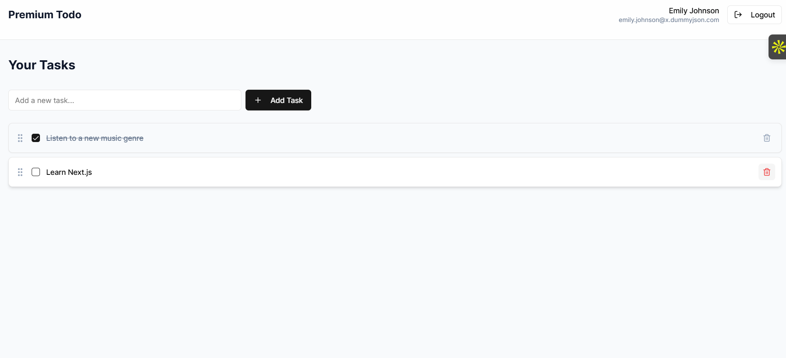

# Premium Todo

A Todo list to organize your tasks better

## Installation

Follow these steps to install and run the project:

1. Install dependencies:
   ```sh
   npm i --legacy-peer-deps
   ```
2. Start the development server:
   ```sh
   npm run dev
   ```
3. When prompted, use the following credentials for reference:
   - **Username:** `emilys`
   - **Password:** `emilyspass`

## Screenshots

Here are some screenshots of the project:

login page UI


Todo List UI


Drag and arrange the tasks as you wish


Add tasks to your list


Delete tasks from your list



## License

Specify your project license here (e.g., MIT, Apache-2.0, etc.).

